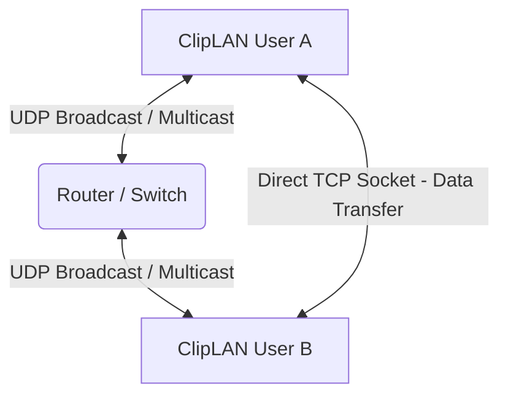

# ClipLAN - System Architecture Document

## 1. Introduction
ClipLAN (also known as cliplan/cliplan) is a 100% serverless, peer-to-peer (P2P) local area network (LAN) file sharing and real-time shared clipboard application. It is designed to operate entirely without internet access, external cloud servers, or manual Bluetooth pairing, providing extremely high-speed, secure, and reliable data transfers across devices on the same network.

---

## 2. Requirements Specification

### 2.1 Functional Requirements
* **Zero-Configuration Discovery:** The system must automatically detect and list other active devices running the application on the same local network.
* **Peer-to-Peer File Transfer:** Users must be able to send and receive single or multiple files directly between devices.
* **Transfer Authorization:** The recipient must be prompted to explicitly accept or reject incoming file transfers.
* **Shared Network Clipboard:** Users must be able to broadcast text snippets to all discovered devices on the network for instant copying.
* **Transfer History & Retry:** The system must maintain a persistent log of past transfers (completed, failed, cancelled) and allow users to retry failed outgoing transfers.
* **Real-Time Progress Monitoring:** The UI must display live transfer speeds (MB/s), percentage completion, and byte counts.
* **Recents Access:** Users must be able to quickly access and resend recently transferred files through a dedicated "Recents" folder.

### 2.2 Non-Functional Requirements
* **High Performance (Max Speed):** Transfers must natively operate at the maximum bandwidth allowed by the physical hardware (e.g., 50MB/s - 100MB/s+) utilizing zero-copy streaming algorithms.
* **Reliability & OOM Protection:** The application must not crash due to Out-Of-Memory (OOM) errors, regardless of file size (e.g., transferring a 50GB file on a 2GB RAM device must remain stable).
* **Background Stability:** Transfers must survive screen sleeps and backgrounding via OS-level CPU wakelocks.
* **Data Integrity:** All transmitted files must undergo real-time cryptographic validation (SHA-256) to guarantee no packet corruption occurred during network transit.
* **Cross-Platform Compatibility:** The architecture must seamlessly run and cross-communicate across Android, iOS, and macOS.
* **Decentralization:** The architecture must strictly avoid single points of failure; no central signaling server or internet connection can be required.

---

## 3. High-Level Design (HLD)

### 3.1 Architectural Pattern
The application follows a **Decentralized Peer-to-Peer (P2P) Architecture** combined with a **Reactive MVVM (Model-View-ViewModel)** pattern on the client UI layer.

### 3.2 Core Components
1. **Discovery Engine (UDP):** A background service operating on UDP Port 53317 that handles multi-cast and broadcast heartbeats to maintain a real-time ledger of network peers.
2. **Transfer Engine (TCP):** A high-throughput, point-to-point binary streaming service operating on TCP Port 53318 for file data and JSON control frames.
3. **State Management (App State):** A centralized reactive data store (`ChangeNotifier`) that bridges the background networking engines to the Flutter UI layer.
4. **Persistent Storage (Hive NoSQL):** A local, lightweight key-value database used to store application settings, device identity, and the transfer history ledger.

### 3.3 System Context Flow

---

## 4. Low-Level Design (LLD)

### 4.1 Discovery Engine (UDP)
* **Protocol:** UDP IPv4.
* **Ports:** 53317.
* **Mechanism:** 
  * Binds a `RawDatagramSocket`.
  * Emits JSON `announce` packets every 2 seconds to `255.255.255.255` (Global), `224.0.0.1`, `224.0.0.251` (Multicast), and subnet-specific broadcast IPs.
  * Maintains a `Map<String, DeviceInfo>` in memory.
  * Implements a **Resilient Garbage Collector** that purges devices only after 15 seconds of missed heartbeats, preventing UI flickering on unstable Wi-Fi.

### 4.2 File Transfer Engine (TCP)
* **Protocol:** TCP IPv4.
* **Ports:** 53318 (with ephemeral fallback).
* **Streaming Algorithm (Zero-Copy):**
  * The TCP receiver utilizes a `streamBytesTo` algorithm, taking raw byte arrays directly from the OS-level TCP buffer and piping them instantly into a Dart `IOSink`.
* **Dynamic Backpressure (OOM Prevention):**
  * Tracks bytes flowing through the pipeline. When the internal threshold hits 10 MB, it executes a synchronous `await sink.flush()`. This pauses the network socket reader until the physical disk write completes, guaranteeing RAM usage never exceeds ~10MB.
  * Resumes the socket listener dynamically when the buffer drops below 2MB to ensure continuous pipeline execution without network starvation.

### 4.3 Data Integrity & Hashing
* **Algorithm:** SHA-256 (`package:crypto/crypto.dart`).
* **Sender:** Computes the digest of the file upfront and embeds the hex string in the `file_start` TCP control packet.
* **Receiver:** Routes the incoming byte stream through `sha256.startChunkedConversion(sink)` *concurrently* while writing to the disk.
* **Validation:** Upon receiving the `file_end` packet, the receiver evaluates the hash. If valid, responds with a `file_ack`.

### 4.4 Local Storage Schema (Hive)
* **Settings Box:** 
  * `deviceId` (UUID v4)
  * `deviceName` (String)
  * `savePath` (String)
* **History Box:**
  * Stores serialized `TransferItem` JSON objects.
  * `FileItem` serialization retains the absolute local `path`, allowing the Transfer Engine to re-read the physical file if a "Retry" is triggered.

---

## 5. Security & Privacy
* **Local Isolation:** Traffic never leaves the local subnet. No cloud relay servers are utilized, eliminating external MITM (Man-In-The-Middle) vectors.
* **Explicit Consent:** The `approval_sheet` strictly gates file saving. Incoming TCP connections cannot write to disk without user interaction unless "Auto-Approve" is explicitly toggled by the user.
* **Sandbox Execution:** Mobile platforms rely on scoped storage. macOS relies on specific App Sandbox entitlement exceptions (`com.apple.security.app-sandbox` set to false) to allow broad directory reads for file selection.
